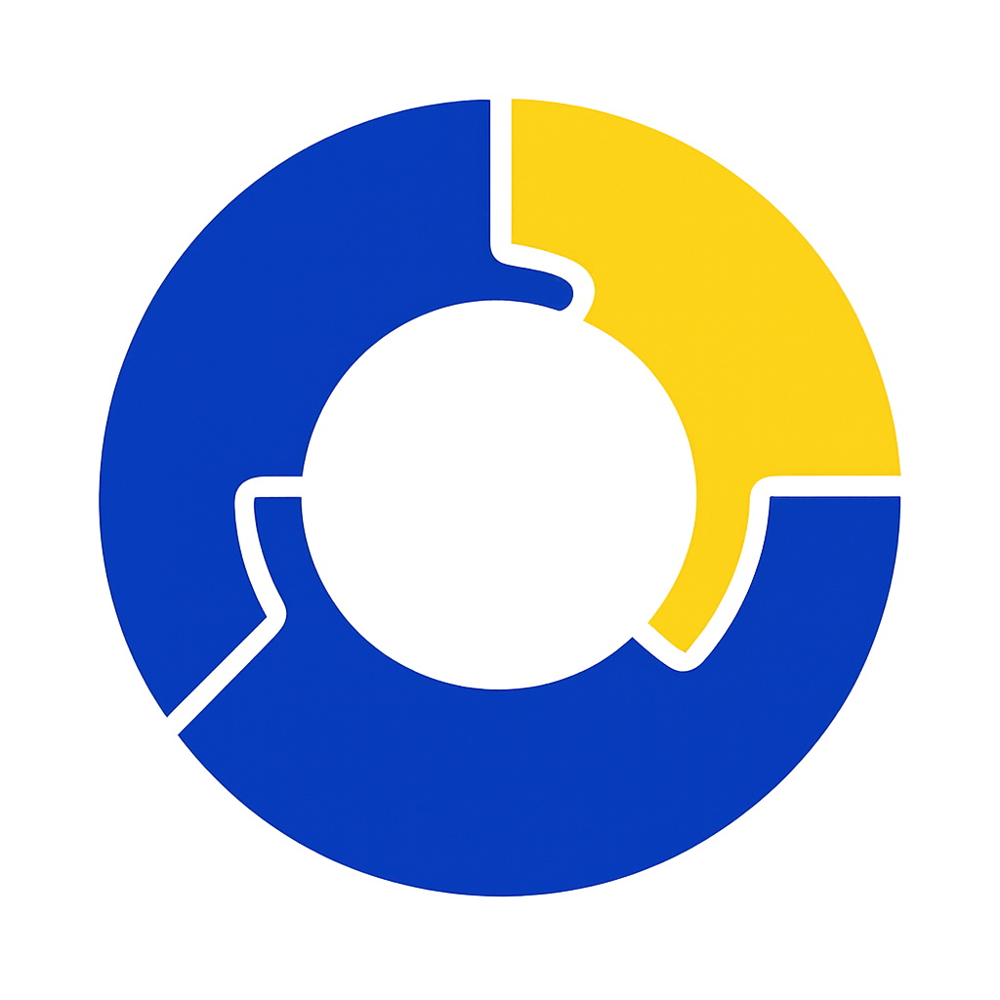

# 🖨️ GUÍA RÁPIDA - Brochure A4 Print Ready

## ✅ Archivo Listo para Imprimir

**Archivo:** `brochure-print-a4.html`

Este brochure está optimizado para **impresión directa en formato A4** usando tus colores corporativos:

- 🔵 Azul Principal: `#063DBD`
- 🟡 Amarillo Acento: `#FDD419`

---

## 📄 Contenido del Brochure (4 páginas A4)

### Página 1 - PORTADA

- Logo Ohanabyte
- Título impactante con colores corporativos
- 4 estadísticas clave
- Diseño moderno con gradientes

### Página 2 - QUIÉNES SOMOS

- Misión y experiencia
- 6 diferenciadores clave
- Diseño limpio y profesional

### Página 3 - SOLUCIONES

- 6 soluciones principales
- Características detalladas
- Layout en grid moderno

### Página 4 - PARTNERS & CONTACTO

- 6 partners tecnológicos
- Información de contacto completa
- CTA destacado

---

## 🚀 CÓMO EXPORTAR A PDF

### Método 1: Desde el Navegador (Recomendado)

1. **Abre el archivo** `brochure-print-a4.html` en **Google Chrome**

2. **Presiona el botón "Imprimir / Exportar PDF"** (esquina inferior derecha)

   - O usa `Ctrl + P` (Windows) o `Cmd + P` (Mac)

3. **Configura las opciones de impresión:**

   ```
   Destino:     Guardar como PDF
   Páginas:     Todas (1-4)
   Diseño:      Vertical
   Márgenes:    Ninguno (Sin márgenes)
   Escala:      100% (Predeterminado)
   Opciones:    ✓ Gráficos de fondo
                ✓ Encabezados y pies de página: DESACTIVADO
   ```

4. **Click en "Guardar"** y elige donde guardar tu PDF

---

### Método 2: Impresión Directa

Si quieres imprimir directamente:

1. Abre el archivo en Chrome
2. Presiona `Ctrl + P`
3. Selecciona tu impresora
4. Usa las mismas configuraciones de arriba
5. Click en "Imprimir"

**Papel recomendado:**

- Tamaño: A4 (210 x 297 mm)
- Tipo: Couché 150-200gr o Bond Premium 120gr
- Acabado: Brillante o Mate según preferencia

---

## 🎨 Personalización Rápida

### Cambiar Textos

Abre el archivo HTML en cualquier editor y busca:

**Cambiar estadísticas:**

```html
<div class="stat-number">+150</div>
<div class="stat-label">Proyectos</div>
```

**Cambiar emails:**

```html
<p>gproyectos@ohanabyte.com.pe</p>
```

### Cambiar Logo

El logo se carga desde:

```html

```

Si necesitas cambiar la ruta, edita esa línea.

---

## 📱 Compartir Digitalmente

### Opción 1: Enviar PDF por Email

1. Exporta a PDF (método arriba)
2. Adjunta en tu email
3. Listo para enviar

### Opción 2: Compartir HTML

1. Sube el archivo HTML a tu servidor web
2. Comparte el enlace directo
3. Se verá perfecto en cualquier navegador

---

## 🎯 Características Destacadas

✅ **Diseño profesional** estilo corporativo  
✅ **Colores corporativos** (#063DBD azul y #FDD419 amarillo)  
✅ **Logo integrado** desde tu carpeta public  
✅ **4 páginas optimizadas** para formato A4  
✅ **Listo para imprimir** sin ajustes adicionales  
✅ **Exportable a PDF** de alta calidad  
✅ **Responsive** (se adapta a pantalla también)  
✅ **Fuentes modernas** Roboto y Montserrat

---

## 🖨️ Especificaciones Técnicas

**Para imprenta profesional:**

- Formato: A4 (210mm x 297mm)
- Orientación: Vertical (Portrait)
- Páginas: 4
- Colores: CMYK
- Resolución: 300 DPI (al exportar desde navegador en alta calidad)
- Tipo de archivo: PDF

**Conversión CMYK sugerida:**

Azul #063DBD:

- C: 100
- M: 80
- Y: 0
- K: 26

Amarillo #FDD419:

- C: 2
- M: 12
- Y: 95
- K: 0

---

## ⚡ Atajos Rápidos

- `Ctrl + P` → Abrir diálogo de impresión
- Click botón inferior derecha → Imprimir directo
- Scroll para revisar las 4 páginas

---

## ✏️ Preguntas Frecuentes

**Q: ¿Se puede imprimir a doble cara?**  
A: Sí, imprime páginas 1-2 en una hoja y 3-4 en otra, luego dobla como díptico.

**Q: ¿Puedo cambiar los colores?**  
A: Sí, edita las variables CSS al inicio del archivo HTML:

```css
--azul-principal: #063dbd;
--amarillo-acento: #fdd419;
```

**Q: ¿Necesito internet para imprimir?**  
A: Sí, usa fuentes de Google Fonts. Para uso offline, descarga las fuentes localmente.

**Q: ¿Funciona en otros navegadores?**  
A: Sí, pero Chrome/Edge dan mejores resultados para exportar PDF.

---

## 📞 Contacto

Si necesitas ajustes o personalizaciones:

- Email: gproyectos@ohanabyte.com.pe
- Web: ohanabyte.com.pe

---

**Creado:** Octubre 2025  
**Versión:** 1.0 - Print Ready  
**Optimizado para:** Impresión A4 y exportación PDF

© 2025 Ohanabyte - Todos los derechos reservados
